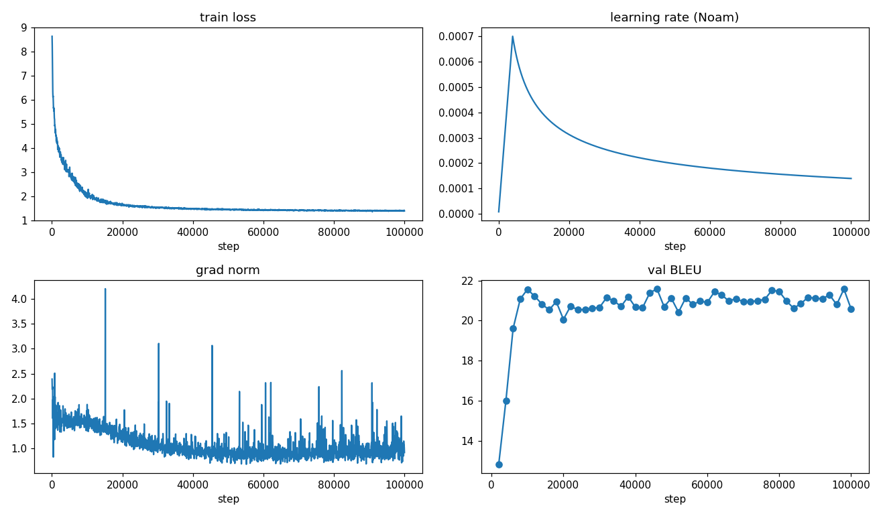

# Attention Is All You Need — from scratch

End-to-end re-implementation of Vaswani et al. (2017), trained on real translation
data (Multi30k En–De first). The goal is **intuition for every component**: we build a
notebook per phase, run on a local Mac (MPS/CPU) with smoke/subset data, then lift the
proven logic into `transformer/` and train for real on an A100.

## Setup

```bash
uv sync
uv run jupyter lab     # open notebooks/00_setup.ipynb first
```

## Notebooks (run in order)

| # | Notebook | Phase |
|---|----------|-------|
| 0 | `notebooks/00_setup.ipynb` | Device + GPU/MPS memory feel-check |
| 1 | `notebooks/01_data_pipeline.ipynb` | Multi30k, BPE, dataset, masks |
| 2 | `notebooks/02_components.ipynb` | PE, MHA, FFN, enc/dec layers |
| 3 | `notebooks/03_full_model.ipynb` | Full Transformer, param count, untrained loss |
| 4 | `notebooks/04_training.ipynb` | Noam schedule, overfit-one-batch, training |
| 5 | `notebooks/05_generation.ipynb` | Greedy + beam decoding |
| 6 | `notebooks/06_evaluation.ipynb` | BLEU with sacrebleu |



(Notebooks are generated from `notebooks/_build.py` — edit cells there and rerun, or edit
the `.ipynb` directly.)

Running a notebook also writes each plot as a standalone PNG to `notebooks/figures/`
(via the `savefig()` helper in the bootstrap cell) — committed for reference, e.g.
`02_positional_encoding.png`, `04_training_curves.png`, `05_alignment.png`.

## Training on the A100

Once the notebooks feel right, train for real with the same `transformer/` code via the
scripts. See [`RUNBOOK.md`](RUNBOOK.md) for the full walkthrough.

```bash
# smoke test the pipeline end-to-end
uv run python scripts/train.py --preset smoke --run-name smoke --max-steps 200

# the A100 first run (~10M params)
uv run python scripts/train.py --preset first-run --run-name first_run --amp --max-steps 100000

# evaluate / translate from a checkpoint
uv run python scripts/translate.py -c checkpoints/first_run.best.pt --bleu --beam 4
uv run python scripts/translate.py -c checkpoints/first_run.best.pt --beam 4 "A man rides a bike."
```
